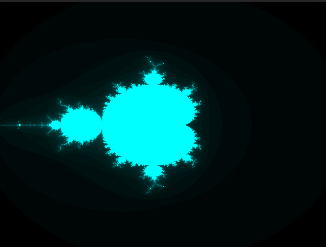
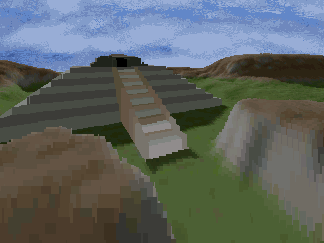
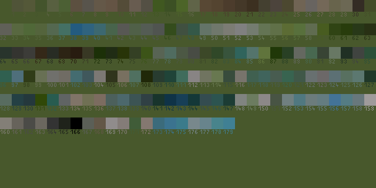

# exdev-gfx
Simple 2D/3D graphics engine for Linux (amd64, arm64), MorphOs (ppc), AmigaOs (68k) and macOS (amd64, arm64) written in C99.  
Currently macOS support is not yet ready (but this will come in near future). 
This library is for private learning purposes only, but there might be some interesting stuff inside.  

# examples
There are two interesting examples which are using this graphics engine.  

## julia
A simple mandelbrot renderer:  

## voxelspace
A simple voxelspace renderer (do you remember [Comanche](https://en.wikipedia.org/wiki/Comanche_(video_game_series))?):  

## sprite
A simple sprite renderer with alpha, scaling and rotation:

# tools
## convert_palette_to_pgm
Converts an existing palette to pgm. 
Usage:

    convert_palette_to_pgm: <palette> <pgm>

# build

## linux

## morphos
To set up a cross-compiler for Linux host you can use this script from here: [MorphOs Cross SDK script](https://bigfoot.morphos-team.net/files/setup-cross-sdk.sh)  
Afterwards you should have a MorphOs cross-compiler and the SDK in path /gg installed.   
You can now cross compile for MorphOs with CMake:

    mkdir build-mos
    cd build-mos
    cmake -DCMAKE_TOOLCHAIN_FILE=../cmake/morphos-pcc.toolchain -DCMAKE_BUILD_TYPE=Release -CCMAKE_INSTALL_PREFIX=/tmp/exdevgfx-mos
    cmake --build . --target install --paralllel 4

For native builds please use the Makefile!

## amigaos
To set up a cross-compiler for Linux host you can use bebbo's gcc compiler: [AmigaOs Cross SDK Git](https://github.com/bebbo/amiga-gcc)  
Afterwards you should have a AmigaOs cross-compiler and the SDK in path /opt/amiga installed.   
You can now cross compile for AmigaOs with CMake:

    mkdir build-amiga
    cd build-amiga
    cmake -DCMAKE_TOOLCHAIN_FILE=../cmake/amiga-gcc.toolchain -DCMAKE_BUILD_TYPE=Release -CCMAKE_INSTALL_PREFIX=/tmp/exdevgfx-amiga
    cmake --build . --target install --paralllel 4

For native builds please use the Makefile!

## macos
